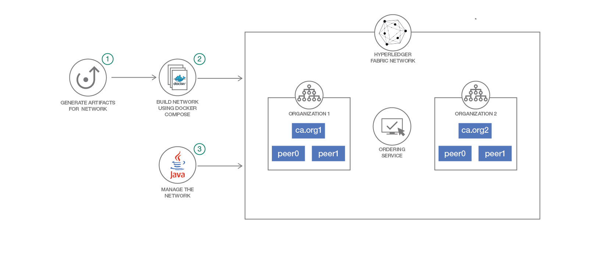

# Create and Deploy a Blockchain Network using Hyperledger Fabric SDK Java

Blockchain is a shared, immutable ledger for recording the history of transactions. The Linux Foundation’s Hyperledger Fabric, the software implementation of blockchain IBM is committed to, is a permissioned network. Hyperledger Fabric is a platform for distributed ledger solutions underpinned by a modular architecture delivering high degrees of confidentiality, resiliency, flexibility and scalability.

In a Blockchain solution, the Blockchain network works as a back-end with an application front-end to communicate with the network using a SDK. To set up the communication between front-end and back-end, Hyperledger Fabric community offers a number of SDKs for a wide variety of programming languages like the NodeJS SDK and Java SDK. This code pattern explains the methodology to create, deploy and test the blockchain network using Hyperledger Fabric SDK Java.

It would be helpful for the Java developers, who started to look into Hyperledger Fabric platform and would like to use Fabric SDK Java for their projects. The SDK helps facilitate Java applications to manage the lifecycle of Hyperledger channels and user chaincode. The SDK also provides a means to execute user chaincode, query blocks and transactions on the channel, and monitor events on the channel. This code pattern will help to get the process started to build a Hyperledger Fabric v1.1 Java application.

When the reader has completed this pattern, they will understand how to create, deploy and test a blockchain network using Hyperledger Fabric SDK Java. This pattern will provision a Hyperledger Fabric 1.1 network consisting of two organizations, each maintaining two peer node, two certificate authorities (ca) for each organization and a solo ordering service. The following aspects will be demonstrated in this code pattern:
* Create and initialize channel
* Install and instantiate chain code
* Register and enroll the users
* Perform invoke and query on the blockchain network.

> **Note:** This code pattern builds a Hyperledger Fabric 1.1 network and uses Hyperledger Fabric SDK java 1.0.0 .

## Flow

   

1. Generate the artifacts using cryptogen and configtx for peers and channel in network. Currently these are already generated and provided in the code repository to use as-is.
2. Build the network using docker-compose and the generated artifacts.
3. Use Hyperledger Fabric Java SDK APIs to work with and manage the network.
    * Create and initialize the channel
    * Install and instantiate the chaincode
    * Register and enroll the users
    * Perform invoke and query to test the network


## Included Components

* [Hyperledger Fabric](https://hyperledger-fabric.readthedocs.io/): Hyperledger Fabric is a platform for distributed ledger solutions underpinned by a modular architecture delivering high degrees of confidentiality, resiliency, flexibility and scalability.

* [Docker](https://www.docker.com/): Docker is an open platform for developers and sysadmins to build, ship, and run distributed applications.

* [Hyperledger Fabric Java SDK](https://github.com/hyperledger/fabric-sdk-java)

## Featured Technologies

* [Blockchain](https://en.wikipedia.org/wiki/Blockchain): A blockchain is a digitized, decentralized, public ledger of all transactions in a network.

* [Java](https://en.wikipedia.org/wiki/Java_(programming_language)): Java is a general-purpose computer-programming language that is concurrent, class-based and object-oriented.

## Watch the Video
[](https://youtu.be/vCTabgkvfS0)]

## Pre-requisites

* [Docker](https://www.docker.com/get-started) - v1.13 or higher
* [Docker Compose](https://docs.docker.com/compose/overview/) - v1.8 or higher
* [Git Client](https://git-scm.com/downloads) - needed for clone commands
* [Maven](https://maven.apache.org/download.cgi) - needed to build the client. Maven is a build automation tool used primarily for Java projects. Maven addresses two aspects of building software: first, it describes how software is built, and second, it describes its dependencies.

## Steps

Follow these steps to setup and run this code pattern.

1. [Setup the Blockchain Network](#1-setup-the-blockchain-network)
2. [Build the client based on Fabric Java SDK](#2-build-the-client-based-on-fabric-java-sdk)
3. [Create and Initialize the channel](#3-create-and-initialize-the-channel)
4. [Deploy and Instantiate the chaincode](#4-deploy-and-instantiate-the-chaincode)
5. [Register and enroll users](#5-register-and-enroll-users)
6. [Perform Invoke and Query on network](#6-perform-invoke-and-query-on-network)

### 1. Setup the Blockchain Network


[Clone this repo](https://github.com/ZaheerUdDeen/BlockchainHealthFYP.git) using the following command.

```
$ git clone https://github.com/ZaheerUdDeen/BlockchainHealthFYP.git
```

To build the blockchain network, the first step is to generate artifacts for peers and channels using cryptogen and configtx. The utilities used and steps to generate artifacts are explained [here](https://hyperledger-fabric.readthedocs.io/en/release-1.1/build_network.html). In this pattern all required artifacts for the peers and channel of the network are already generated and provided to use as-is. Artifacts can be located at:

   ```
   network_resources/crypto-config
   network_resources/config
   ````

The automated scripts to build the network are provided under `network` directory. The `network/docker-compose.yaml` file defines the blockchain network topology. This pattern provisions a Hyperledger Fabric 1.1 network consisting of two organizations, each maintaining two peer node, two certificate authorities for each organization and a solo ordering service. Need to run the script as follows to build the network.

> **Note:** Please clean up the old docker images (if any) from your environment otherwise you may get errors while setting up network.

   ```
   cd network
   chmod +x build.sh
   ./build.sh
   ```

To stop the running network, run the following script.

   ```
   cd network
   chmod +x stop.sh
   ./stop.sh
   ```

To delete the network completely, following script need to execute.

   ```
   cd network
   chmod +x teardown.sh
   ./teardown.sh
   ```
> **Note:** after ./build.start when your network is up and runing follow step 2,3,4,5 consecutively. might you will face multiple try out of stop and build again. after each build.sh follow step 2 and onward.


### 2. Build the client based on Fabric Java SDK

The previous step creates all required docker images with the appropriate configuration.

**Java Client**
* The java client sources are present in the folder `java` of the repo.
* Check your environment before executing the next step. Make sure, you are able to run `mvn` commands properly.
   > If `mvn` commands fails, please refer to [Pre-requisites](#pre-requisites) to install maven.


To work with the deployed network using Hyperledger Fabric SDK java 1.0.0, run the the following script

* Open a command terminal and navigate to the `network_resource` directory in the repo. Run the command `createJar.sh`.

   ```
   ./createJar.sh
   ```

### 3. Create and Initialize the channel

In this code pattern, we create one channel `mychannel` which is joined by all four peers. The java source code can be seen at  `src/main/java/org/app/network/CreateChannel.java`. To create and initialize the channel, run the following command.

   ```
  java -cp blockchain-healthcare.jar main.java.org.app.network.CreateChannel

   ```

Output:

   ```Apr 20, 2018 5:11:42 PM org.app.util.Util deleteDirectory
      INFO: Deleting - users
      Apr 20, 2018 5:11:45 PM org.app.network.CreateChannel main
      INFO: Channel created mychannel
      Mar 29, 2019 1:37:52 AM main.java.org.app.network.CreateChannel main
      INFO: peer0.org1.example.com at grpc://localhost:7051
      Mar 29, 2019 1:37:52 AM main.java.org.app.network.CreateChannel main
      INFO: peer1.org1.example.com at grpc://localhost:7056

   ```

### 4. Deploy and Instantiate the chaincode

This code pattern uses a  chaincode `emergencyHealthCare` to demo the usage of Hyperledger Fabric SDK Java APIs. To deploy and instantiate the chaincode, execute the following command.

   ```
  java -cp blockchain-healthcare.jar main.java.org.app.network.DeployInstantiateChaincode
   ```

   Output:

   ``` 
log4j:WARN No appenders could be found for logger (org.hyperledger.fabric.sdk.helper.Config).
log4j:WARN Please initialize the log4j system properly.
log4j:WARN See http://logging.apache.org/log4j/1.2/faq.html#noconfig for more info.
Mar 29, 2019 1:38:07 AM main.java.org.app.client.FabricClient deployChainCode
INFO: Deploying chaincode emergencyHealthCare using Fabric client Org1MSP admin
Mar 29, 2019 1:38:08 AM main.java.org.app.network.DeployInstantiateChaincode main
INFO: emergencyHealthCare- Chain code deployment SUCCESS
Mar 29, 2019 1:38:08 AM main.java.org.app.network.DeployInstantiateChaincode main
INFO: emergencyHealthCare- Chain code deployment SUCCESS
Mar 29, 2019 1:38:08 AM main.java.org.app.client.ChannelClient instantiateChainCode
INFO: Instantiate proposal request emergencyHealthCare on channel mychannel with Fabric client Org1MSP admin
Mar 29, 2019 1:38:08 AM main.java.org.app.client.ChannelClient instantiateChainCode
INFO: Instantiating Chaincode ID emergencyHealthCare on channel mychannel
Mar 29, 2019 1:38:11 AM main.java.org.app.client.ChannelClient instantiateChainCode
INFO: Chaincode emergencyHealthCare on channel mychannel instantiation java.util.concurrent.CompletableFuture@5b218417[Not completed]
Mar 29, 2019 1:38:11 AM main.java.org.app.network.DeployInstantiateChaincode main
INFO: emergencyHealthCare- Chain code instantiation SUCCESS
Mar 29, 2019 1:38:11 AM main.java.org.app.network.DeployInstantiateChaincode main
INFO: emergencyHealthCare- Chain code instantiation SUCCESS
  ```

   > **Note:** The chaincode emergencyHealthCare.go was taken from BlockchainHealthcare/network_resources/chaincode/src/github.com/emergencyHealthcare/emergencyHealthCare.go

### 5. Register and enroll users

A new user can be registered and enrolled to an MSP. Execute the below command to register a new user and enroll to Org1MSP.

   ```
   java -cp blockchain-healthcare.jar main.java.org.app.user.RegisterEnrollUser
   ```

   Output:

   ```Apr 23, 2018 10:26:34 AM org.app.util.Util deleteDirectory
      INFO: Deleting - users
      log4j:WARN No appenders could be found for logger (org.hyperledger.fabric.sdk.helper.Config).
      log4j:WARN Please initialize the log4j system properly.
      log4j:WARN See https://logging.apache.org/log4j/1.2/faq.html#noconfig for more info.
      
	Mar 29, 2019 1:23:51 AM main.java.org.app.client.CAClient enrollAdminUser
	INFO: CA -http://localhost:7054 Enrolled Admin.
	Mar 29, 2019 1:23:51 AM main.java.org.app.client.CAClient registerUser
	INFO: CA -http://localhost:7054 Registered User - user1553804631201
	Mar 29, 2019 1:23:52 AM main.java.org.app.client.CAClient enrollUser
	INFO: CA -http://localhost:7054 Enrolled User - user1553804631201

   ```

### 6. Perform Invoke and Query on network

Blockchain network has been setup completely and is ready to use. Now we can test the network by performing invoke and query on the network. The `blockchainHealthcare` chaincode allows us to create a new asset which is a car. For test purpose, invoke operation is performed to create a new asset in the network and query operation is performed to list the asset of the network. Perform the following steps to check the same.

   ```
   java -cp blockchain-healthcare.jar main.java.org.app.chaincode.invocation.RegisterPatient 
   ```

   Output:

   ```Apr 04, 2019 2:25:15 AM main.java.org.app.util.Util deleteDirectory
INFO: Deleting - admin.ser
Apr 04, 2019 2:25:15 AM main.java.org.app.util.Util deleteDirectory
INFO: Deleting - user1554326606705.ser
Apr 04, 2019 2:25:15 AM main.java.org.app.util.Util deleteDirectory
INFO: Deleting - org1
Apr 04, 2019 2:25:15 AM main.java.org.app.util.Util deleteDirectory
INFO: Deleting - users
log4j:WARN No appenders could be found for logger (org.hyperledger.fabric.sdk.helper.Config).
log4j:WARN Please initialize the log4j system properly.
log4j:WARN See http://logging.apache.org/log4j/1.2/faq.html#noconfig for more info.
Apr 04, 2019 2:25:18 AM main.java.org.app.client.CAClient enrollAdminUser
INFO: CA -http://localhost:7054 Enrolled Admin.
Apr 04, 2019 2:25:20 AM main.java.org.app.client.ChannelClient sendTransactionProposal
INFO: Sending transaction proposal on channel mychannel
Apr 04, 2019 2:25:21 AM main.java.org.app.client.ChannelClient sendTransactionProposal
INFO: Transaction proposal on channel mychannel OK SUCCESS with transaction id:c6bfdafbe1b61275330d441534bb56e73b99bc71bd5db09133bdc0e43c92f80e
Apr 04, 2019 2:25:21 AM main.java.org.app.client.ChannelClient sendTransactionProposal
INFO: 
Apr 04, 2019 2:25:21 AM main.java.org.app.client.ChannelClient sendTransactionProposal
INFO: java.util.concurrent.CompletableFuture@68df9280[Not completed]
Apr 04, 2019 2:25:21 AM main.java.org.app.chaincode.invocation.RegisterPatient main
INFO: Invoked registerPatient on blockchainHealthcare. Status - SUCCESS

  ```

   ```
   java -cp blockchain-healthcare.jar main.java.org.app.chaincode.invocation.RegisterDoctor
   ```

   Output:

   <pre>
    Apr 04, 2019 2:27:23 AM main.java.org.app.util.Util deleteDirectory
INFO: Deleting - admin.ser
Apr 04, 2019 2:27:23 AM main.java.org.app.util.Util deleteDirectory
INFO: Deleting - org1
Apr 04, 2019 2:27:23 AM main.java.org.app.util.Util deleteDirectory
INFO: Deleting - users
log4j:WARN No appenders could be found for logger (org.hyperledger.fabric.sdk.helper.Config).
log4j:WARN Please initialize the log4j system properly.
log4j:WARN See http://logging.apache.org/log4j/1.2/faq.html#noconfig for more info.
Apr 04, 2019 2:27:26 AM main.java.org.app.client.CAClient enrollAdminUser
INFO: CA -http://localhost:7054 Enrolled Admin.
Apr 04, 2019 2:27:28 AM main.java.org.app.client.ChannelClient sendTransactionProposal
INFO: Sending transaction proposal on channel mychannel
Apr 04, 2019 2:27:28 AM main.java.org.app.client.ChannelClient sendTransactionProposal
INFO: Transaction proposal on channel mychannel OK SUCCESS with transaction id:1b595a985f60aca197b2761ee233d62ef09d8b145db4d37a9ee65eb17df214ec
Apr 04, 2019 2:27:28 AM main.java.org.app.client.ChannelClient sendTransactionProposal
INFO: 
Apr 04, 2019 2:27:28 AM main.java.org.app.client.ChannelClient sendTransactionProposal
INFO: java.util.concurrent.CompletableFuture@479460a6[Not completed]
Apr 04, 2019 2:27:28 AM main.java.org.app.chaincode.invocation.RegisterDoctor main
INFO: Invoked registerDoctor on blockchainHealthcare. Status - SUCCESS

   </pre>


 ```
   java -cp blockchain-healthcare.jar main.java.org.app.chaincode.invocation.QueryPatient
   ```

   Output:

   <pre>
    Apr 04, 2019 2:27:40 AM main.java.org.app.util.Util deleteDirectory
INFO: Deleting - admin.ser
Apr 04, 2019 2:27:40 AM main.java.org.app.util.Util deleteDirectory
INFO: Deleting - org1
Apr 04, 2019 2:27:40 AM main.java.org.app.util.Util deleteDirectory
INFO: Deleting - users
log4j:WARN No appenders could be found for logger (org.hyperledger.fabric.sdk.helper.Config).
log4j:WARN Please initialize the log4j system properly.
log4j:WARN See http://logging.apache.org/log4j/1.2/faq.html#noconfig for more info.
Apr 04, 2019 2:27:43 AM main.java.org.app.client.CAClient enrollAdminUser
INFO: CA -http://localhost:7054 Enrolled Admin.
Apr 04, 2019 2:27:45 AM main.java.org.app.chaincode.invocation.QueryChaincode main
INFO: Querying for all patients ...
Apr 04, 2019 2:27:45 AM main.java.org.app.client.ChannelClient queryByChainCode
INFO: Querying queryAllPatient on channel mychannel
Apr 04, 2019 2:27:45 AM main.java.org.app.chaincode.invocation.QueryChaincode main
INFO: [{"Key":"Zaheer", "Record":{"firstName":"Chevy","secondName":"Volt","age":"Red","address":"Nick"}}]
Apr 04, 2019 2:27:46 AM main.java.org.app.chaincode.invocation.QueryChaincode main
INFO: Querying for a Patient - Waqas
Apr 04, 2019 2:27:46 AM main.java.org.app.client.ChannelClient queryByChainCode
INFO: Querying queryPatient on channel mychannel
Apr 04, 2019 2:27:46 AM main.java.org.app.chaincode.invocation.QueryChaincode main
INFO: 

   </pre>


   ```
	java -cp blockchain-healthcare.jar main.java.org.app.chaincode.invocation.QueryDoctors
   ```

   Output:

   <pre>Apr 04, 2019 2:27:53 AM main.java.org.app.util.Util deleteDirectory
INFO: Deleting - admin.ser
Apr 04, 2019 2:27:53 AM main.java.org.app.util.Util deleteDirectory
INFO: Deleting - org1
Apr 04, 2019 2:27:53 AM main.java.org.app.util.Util deleteDirectory
INFO: Deleting - users
log4j:WARN No appenders could be found for logger (org.hyperledger.fabric.sdk.helper.Config).
log4j:WARN Please initialize the log4j system properly.
log4j:WARN See http://logging.apache.org/log4j/1.2/faq.html#noconfig for more info.
Apr 04, 2019 2:27:56 AM main.java.org.app.client.CAClient enrollAdminUser
INFO: CA -http://localhost:7054 Enrolled Admin.
Apr 04, 2019 2:27:58 AM main.java.org.app.chaincode.invocation.QueryDoctors main
INFO: Querying for all Doctors ...
Apr 04, 2019 2:27:58 AM main.java.org.app.client.ChannelClient queryByChainCode
INFO: Querying queryAllDoctors on channel mychannel
Apr 04, 2019 2:27:58 AM main.java.org.app.chaincode.invocation.QueryDoctors main
INFO: [{"Key":"Dr Waheed", "Record":{"firstName":"Ahmed","secondName":"034397156453","age":"Normal","address":"Peshawar"}},{"Key":"Zaheer", "Record":{"firstName":"Chevy","secondName":"Volt","age":"Red","address":"Nick"}}]
Apr 04, 2019 2:27:59 AM main.java.org.app.chaincode.invocation.QueryDoctors main
INFO: Querying for a Doctor - Waqas
Apr 04, 2019 2:27:59 AM main.java.org.app.client.ChannelClient queryByChainCode
INFO: Querying queryDoctor on channel mychannel
Apr 04, 2019 2:27:59 AM main.java.org.app.chaincode.invocation.QueryDoctors main
INFO:

   </pre>
[Apache Software License (ASL) FAQ](https://www.apache.org/foundation/license-faq.html#WhatDoesItMEAN)

